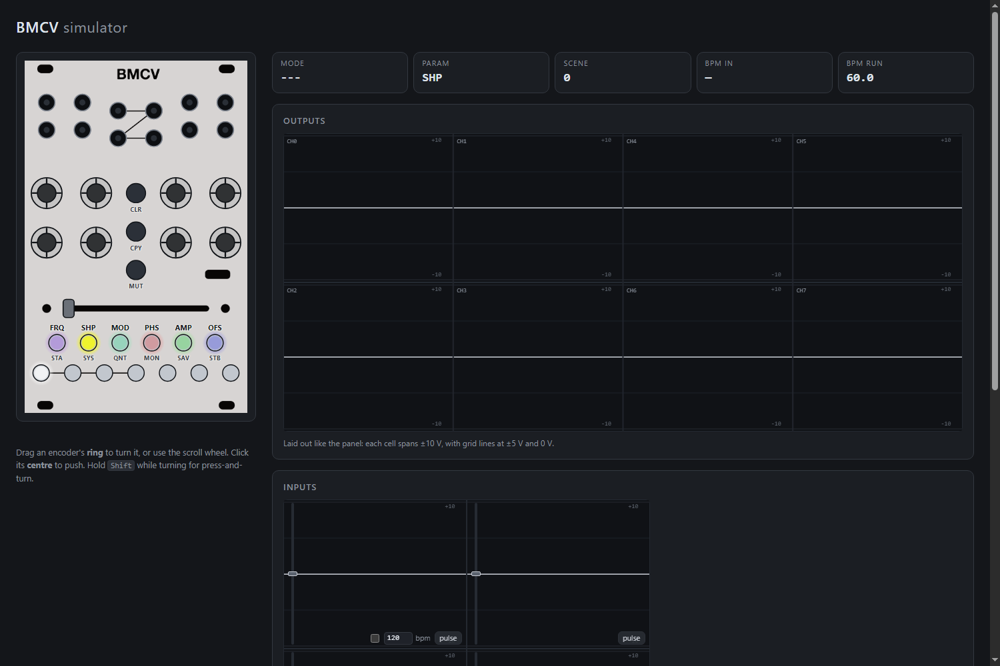
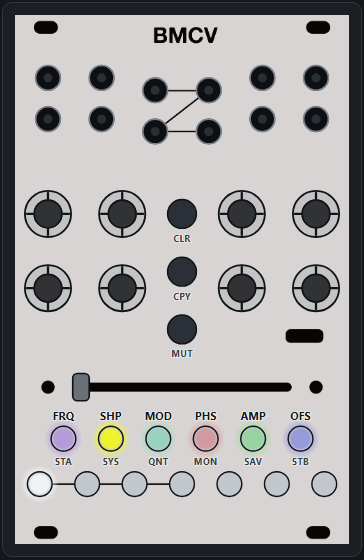

# BMCV

Eight scene-crossfaded LFOs in 16HP, with a PLL that locks them to an incoming
clock. This repository is the firmware, and three other things that run the
same firmware: a headless simulator, a browser frontend, and a VCV Rack module.

## What the module does

Eight **channels**, each a low-frequency oscillator with six parameters -
frequency, shape, modulation, phase, amplitude and offset. Every channel has an
output jack and an endless encoder.

Seven **scenes**, each holding a complete set of those parameters for all eight
channels. The crossfader blends between two of them, **A** and **B**, so one
slider morphs the whole patch. Scenes are the reason the module is not simply
eight LFOs: you dial a state, assign it to A, dial another, assign it to B, and
the fader is now a transition between them.

One **clock input**. Channel frequencies are ratios of the incoming beat rather
than free-running rates, so everything stays in phase with the rest of a patch.
With no clock the module free-runs at the last tempo it saw.

## Using it

**The parameter row.** The six buttons under the crossfader - FRQ, SHP, MOD,
PHS, AMP, OFS - choose what the eight encoders edit. Tap one and turn an
encoder: that channel's parameter moves in the active scene. Each button glows
in its own colour so the row itself says which colour means which parameter.

**Turning something up.** A module fresh out of the box is silent, because AMP
is zero everywhere - so tap AMP and wind a channel's encoder up. That is the
whole of "make a sound".

**Holding a button opens a page.** Hold any of the nine control buttons for a
moment and the module latches into that *shift mode*; the panel repaints and
the encoders and scene buttons mean something else while it is held. Tap the
same button to leave. The nine pages are described under [Shift
Modes](#shift-modes) below.

**Fine adjust.** Press an encoder in while turning it.

**Nothing commits until you let go.** Holds that destroy something - clearing a
channel, clearing every scene - show what they are about to do while you hold
them and only act on release.

The colours are not decoration: see [LED language](#led-language). One fact per
LED, and the same colour for the same idea on every page.

## Trying it without hardware

    just web        # the browser simulator, at http://localhost:8000
    just vcv-install    # the VCV Rack module

Both run this repository's `Core/Src/Lib` unmodified - the same `engine_tick`,
the same UX layer, the same LED renderer - so what they do is what the module
does. See [docs/architecture.md](docs/architecture.md) for how that is arranged
and what each directory is for.

## Building

    just build            # ARM firmware        just flash
    just check            # everything host-side: tests, golden flows, wasm, web
    just web              # the browser simulator
    just vcv-sdk          # fetch the Rack SDK, once
    just vcv-install      # build the Rack plugin into ~/.local/share/Rack2

    # Rack running on Windows while you build in WSL. Needs the cross-compiler
    # once: sudo apt install gcc-mingw-w64-x86-64 g++-mingw-w64-x86-64
    just vcv-win-sdk      # fetch the Windows Rack SDK, once
    just vcv-win-install  # cross-build plugin.dll into %LOCALAPPDATA%\Rack2

    just panel            # regenerate the panel spec from the hardware repo
    just docs-shots       # regenerate the screenshots above

Anything machine-specific - where your Rack SDK lives, which browser to drive -
goes in `local.just`, which is not checked in. `CMakeLists.txt` has the same
arrangement with `local.cmake`.

## LED language

One fact per LED, and the same colour for the same idea on every page.

- **Ctrl-page settings clamp, they do not wrap.** Each is a short list of
  unrelated states with its default at index 0, so spinning an encoder fully
  left resets it and you can do that without looking. Rolling off one end into
  the other would be the largest change on the page.
- **Setting states** are the base layer. Index 0 of every setting - disabled,
  default, neutral - is **purple**; **cyan** is continuous / level-following or
  multiplicative, **green** additive or half-way, **yellow** triggered / clocked
  / stepped, **red** reset. Destructive is **pink**, and belongs to clearing
  alone. See `HUE_STATE_*` in `color_presets.h`. The output
  clamp is the one place brightness also carries meaning, because it is two
  facts on one LED.
- **White is assignment, and nothing else uses it.** A short white flash every
  1.6s over an element's own colour means "you can pick this". Once something is
  held, the places it can go are steady white with a short dropout, the held
  source is steady saturated purple, and everything else goes **dark** - if it
  cannot be pressed it does not light.
- **Output level** only appears when no shift mode is active. In a shift mode
  the encoder ring shows that mode's setting, or nothing if it has none.
- **Confirmations** are a brief flash on top: purple wrote, pink cleared, cyan
  loaded. Purple is the selection colour, so a copy landing somewhere flashes
  the colour the source was held in. Red is errors only.
- **A held press dips out once as it crosses each of its thresholds** - off,
  then back on - which says "that registered" rather than pulsing away as if
  something were still in progress. At the first stage it comes back exactly as
  the page had it; where holding longer does something wider - clearing every
  scene rather than this one - it comes back brighter, in the same colour.
  Nothing commits until the release.

## Shape modes

SHP picks the shape; **MOD is the second axis**, and what it means per mode:

| mode | SHP | MOD |
|---|---|---|
| wavetable | table slice | **skew** - leans the waveform early or late |
| stepped random | pattern morph | **density** - how often a step ties to the previous value instead of taking a new one |
| PWM | pulse width | **envelope** - ramp time on one edge |

Three modes, not five: the stepped variants were one algorithm at three hold
values, which made a long list out of one idea. If hold comes back it should
come back as a per-channel setting, the way pattern length did.

Where MOD leans something, the sign is the same everywhere: **negative leans
early, positive leans late.** Stepped random is the exception - density has no
early or late - and there negative is busy, positive is sparse.

- **Wavetable skew** is a rational phase warp that fixes both cycle endpoints
  and is monotone, so the loop still closes; it turns a sine into a skewed sine
  and a triangle into a ramp.
- **Stepped density** at MOD 0 is the 30% tie probability the pattern was
  designed around: fully left every step takes a new value, fully right the
  cycle is a handful of long notes. Faded in on short patterns, where one tie
  flattens too much. The normalisation table carries a probability axis so the
  correction holds as MOD moves.
- **PWM envelope**: MOD 0 is a hard gate. Negative snaps up and decays through
  the off-time; positive swells across the on-time and drops at the end. Each
  ramp is confined to its own segment, so the width still means what it says at
  either extreme, and the ramps are curved - concave attack, convex decay - so
  the negative side reads as an envelope rather than a triangle. A narrow pulse
  with MOD hard left is a percussive envelope locked to the beat.

## Shift Modes

### STA/STB - Assign Scenes

- Scene Buttons:
  - Assign Scene 1-7 to A/B
- Channel Encoders (STA):
  - Stepped-random pattern length: how many steps a cycle is divided into, from
    a curated set (3..64). Per channel, not per scene - there is nothing between
    8 steps and 12, so a crossfaded value would be meaningless. Dark and inert
    on channels that are not in a stepped mode.
- Channel Encoders (STB):
  - Nothing (Maybe: transition/smoothing sensitivity)

### SYS - System Config & Channel Modes

- Scene Buttons:
  - Input mode (1-4)
  - TODO: Clock div
  - TODO: PLL sensitivity? Could also be per channel?
- Channel:
  - Set Waveshape mode: wavetable, stepped random, PWM square.

### SAV - Save & Load

- Scene Buttons:
  - Save to/Load from slot 1-7
- Channel:
  - Output clamp, per channel: +/-10V (purple), +/-5V (dim purple), 0..10V
    (green), 0..5V (dim green). A clamp and not a scaling, so the parameters
    keep meaning what they say. It describes what the module is patched into
    rather than what the patch is, which is why it is not per scene and why a
    channel clear leaves it alone.

### MON - Monitor & Mixing

Scene Buttons: - Display inputs (only the four that are inputs; the rest are
dark and inert)
Channel: - Press: select Input (TODO: Add other channels besides inputs) -
Rotate: Cross Modulation mode (Off, Add, Mult)

### QNT - Quantizer

Scene Buttons: - Quantizer State
Channel: - Rot: Quantizer Mode - Press: Assign Sample Trigger

### CLR - Clear Channels & Scenes

Everything on the page is one act, so it wears one colour: pink, marked white.
Pink rather than purple, which means "off" or "default" on half the other pages
and reads as far too neutral for the one page that destroys things.

Scene Buttons: - Select scene to clear
Channel: - Tap clears that channel in the active scene. Hold clears the whole
channel: every scene, plus its MON routing and cross-modulation mode, its QNT
mode and trigger source, its shape mode and pattern length. Not the output
clamp.

### CPY - Copy Channels & Scenes

The same, in blue.

Scene Buttons: - Select scene to copy from/to
Channel: - Select channel to copy from/to

### MUT - Mute

Scene Buttons: - Nothing yet
Channel: - Press (toggles on release) mutes that channel's output; rotating is
absolute, right unmutes and left mutes, so a row can be muted by feel. Ramped
over 5ms so it does not click. The channel keeps running: it still feeds
cross-modulation and still works as a trigger source for other channels. A
muted channel shows dim purple here and with no mode active - on the other
pages that LED belongs to whatever the page edits. Mute clears on power cycle.

### No mode

Ctrl Buttons: - Each parameter button glows very dim in its own colour, so the
row says which colour means which parameter; the selected one is several times
brighter. All dark while a shift mode is running.
Scene Buttons: - Hold to make that scene active momentarily
Channel: - The ring is a level meter, showing what the channel is putting out.
Touching any encoder, or tapping a parameter button (including the one already
selected), shows that parameter on **all eight** for a couple of seconds - the
point of seeing it is to compare the channels against each other - then decays
back to the meter. Leaving a shift mode does not: that lands straight back on
the meter.

Press to clear the parameter in the active scene, hold to clear it in every
scene - pink while held, dipping out once at each threshold and brighter for the
wider one, then a pink flash on release. Holding while turning is the
fine-adjust modifier and clears nothing.

## Still to do

- [x] Refactor update code & state access
  - [x] Consistent time (one UI dt, accumulated in ui_input and drained per UX pass)
  - [x] Consistent events (ui_input.h derives button gestures once; deltas accumulate until drained)
- [ ] PLL error term & sensitivity tuning
- [x] Verify output levels & ranges (AMP at full scale is the full +/-10V)
- [ ] Verify output precision
- [x] Add a stepped random shape mode
  - SHP morphs the pattern, MOD sets its density; length is per channel, on STA
  - Loops seamlessly, so it stays locked under the PLL
- [ ] Full Input & Channel Cross modulation support
- [x] MOD as a second shaping parameter in every shape mode
- [x] UX: Fix long press control button in quantizer mode
- [x] UX: Consistent colors (semantic palette in color_presets.h)
- [x] UX: Consistent blinking (white mark for assignment; source and mute steady)
- [x] UX: Consistency with channel knob display & adjustments in shift mode(s)
- [x] UX: Consistent "mark" feature (transient value display, all modes)
- [x] UX: A shift mode's channel LEDs show that mode's setting, never the output
- [ ] UX: Tune UI_EDIT_DISPLAY / UI_FB_DURATION / MARK_BLINK_ON / UI_HELD_DIP on hardware

### Left over from the virtual BMCV

The simulator, the web frontend and the VCV Rack module all run this repo's
core. Three things in `panel/overrides.json` are still inferred rather than
measured, and one thing is only cosmetic but is the first thing anyone judges:

- [ ] Confirm the input jack -> ADC index order on hardware: patch DC into one
      jack at a time and watch `HwState.input_state[]`. Static analysis cannot
      settle the `ADDR` phase; the panel's reading order picked between the two.
- [ ] Measure the RV13 wiper stroke. `travel_mm` is 49.0, inferred from the slot
      drawn in `web/bmcv_panel.png` rather than from the part.
- [ ] LED gamma. `led_fb.c` drives real WS2812s and both frontends approximate
      them with `LED_FULL_VALUE`/`LED_GAMMA` (`sim/include/led_color.h`, mirrored
      in `web/leds.js`). Neither has been held next to a real module.
- [ ] Read `dac_fps`/`engine_fps` off hardware and set the hosts' control rate
      to what the board really achieves. 4kHz is an estimate.
