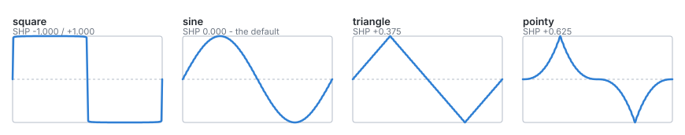
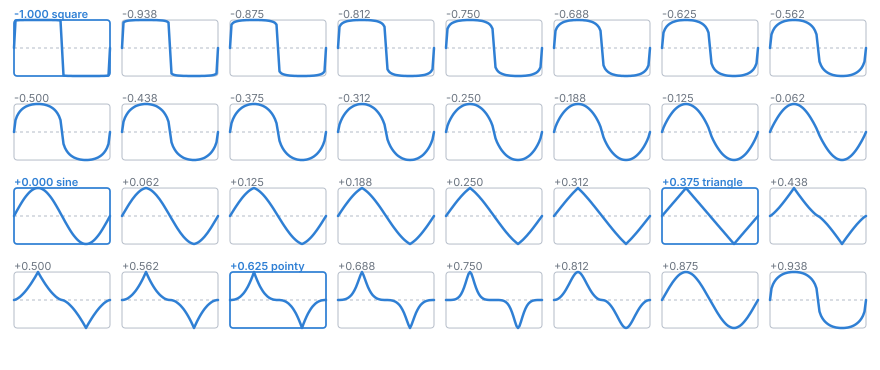

# The wavetable

The shape axis of `SHAPE_LFO`. Generated by `tools/gen_wavetable.py` - the
header, its data and the pictures on this page all come out of one run of it, so
a plot here cannot show a shape the firmware does not have. `just wavetable`,
and `just wavetable --report` for the same thing as sparklines in a terminal.

## The named shapes

**SINE** is at SHP 0, which is what a channel resets to, and it is `sin(2*pi*p)`
to better than one LSB of the int16 it is stored in. **TRIANGLE** is exact too.
The axis is built from two curve families that share those two shapes exactly,
so the joins between them are identities rather than approximations.

## Where phase 0 is

**The rising edge**, in every shape: zero and rising at phase 0, peak at a
quarter, zero and falling at a half, trough at three quarters.

This is not arbitrary, and it is not only about the wavetable. The other two
shape modes already put their *event* on the beat - `SHAPE_PWM` opens its gate
at phase 0, `SHAPE_STEPPED` begins step 0 at phase 0 - and the wavetable was the
odd one out, with its trough on the beat and its rising edge a quarter of a
cycle late. So PHS 0 meant something different depending on which shape mode a
channel happened to be in.

The case that makes it concrete is the square. A channel in the square shape at
a whole-number division of the beat is a **clock divider**, and a divider whose
edge is not on the beat is not one. With the old alignment a divide-by-two gate
opened half a beat late, every time; `a_square_channel_divides_the_clock` in the
tests now drives the real engine against a real clock and checks that every gate
opens on a beat, at ÷2 and ÷4.

None of this costs anything. The guarantees below are about all the slices
sharing the *same* anchor phases, not about which phases those are, so the whole
table is simply rotated a quarter cycle on its way out of the generator - an
exact shift of whole samples, since WT_LEN is a multiple of four. It also puts
the canonical shapes in their canonical form: the sine is `sin(2*pi*p)` rather
than `-cos(2*pi*p)`.

PHS is still there for offsetting deliberately. The point of the convention is
that PHS **0** now means one thing.

## The sweep

Every second slice, with the four exact shapes picked out in blue. It reads as a
**ring**, not a line: SHP wraps at the parameter as well as in the lookup, so
the last frame is a neighbour of the first, and turning the encoder forever
cycles the shapes rather than stopping.

The keyframes are in the strip by construction, not by luck - `svg_axis` unions
the even grid with the named slice indices. They all sit on multiples of four
today, so any sensible grid would catch them; move one by a single slice and a
grid alone would quietly stop showing it, which is the sort of thing a reader
notices long after it stops being true.

Slices are spaced evenly in RMS rather than evenly in the shape exponent. An
exponent axis crowds all of its visible change into one end - the first draft of
the generator did exactly that and produced fifteen consecutive slices that were
the same square. Reading left to right, that is why the change per frame looks
roughly even in the first two rows and quickens through the return leg: the
return covers far more of the RMS range in far fewer slices, because SINE has to
land on SHP 0 and that fixes how the rest of the axis is divided up.

## What the shapes are built from

Each wave is an odd monotone rise curve `S(u)` mapping `[-1, 1]` onto itself,
laid out as

    w(p) = S(4p - 1)      for p in [0, 0.5]
    w(p) = -w(p - 0.5)    for p in [0.5, 1]

and then rotated a quarter cycle, per the convention above. Written this way
because it is the form the argument is easiest to state in; the rotation is a
relabelling of the phase axis and changes nothing below.

This makes four things true of every slice without anyone checking:

- it reaches `-1` and `+1`, at the same two phases in every slice, so **the full
  swing** - and so PHS means the same thing at every shape;
- it stays inside the range, because `S` does;
- **no DC offset**, by the half-wave antisymmetry;
- and the one that matters most: **a convex combination of monotone rise curves
  is a monotone rise curve**. The runtime interpolates between slices, so a knob
  between two entries is the normal case rather than an edge one - and every
  such blend is another member of the family, anchored the same way. Full
  amplitude between slices is arithmetic here, not something tuned for, and it
  holds across the wrap like everywhere else.

That last property is why the table is generated rather than drawn. The
hand-drawn table it replaced had every slice at full scale and still went
**silent** at one setting: slices 13 and 14 were the same wave in opposite
phase, and their midpoint cancelled to 0.0003 of a possible 2.0. Nothing had
ever looked at what happened between two slices.

`tests/test_wavetable.c` asserts all of it against the *lookup* rather than
against the table, because the lookup is what a channel hears.

## What is deliberately absent

- **saw / ramp** - MOD's skew already makes one out of the triangle, and a saw
  cannot satisfy the anchoring above: its extreme is at the cycle boundary
  rather than at the half cycle.
- **staircases** - `SHAPE_STEPPED` is a whole mode for those, with a pattern
  length and a density of its own. The drawn table spent about thirty of its
  117 slices on them.
- **pulse widths** - `SHAPE_PWM` is that mode, with a width and an envelope.
  Those slices were also where the drawn table's DC offset came from.

Dropping all three, and the runs of up to five identical slices, took the table
from 117 slices to 64 and 28KB off the firmware.
