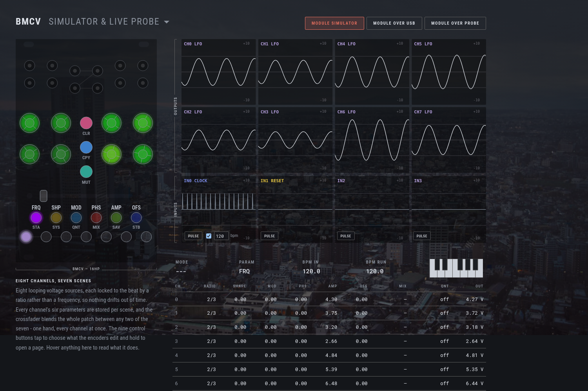

# BMCV

Eight scene-crossfaded LFOs in 16HP, with a PLL that locks them to an incoming
clock. This repository is the firmware, and three other things that run the
*same* firmware: a headless simulator, a browser frontend, and a VCV Rack
module.

**[bemeier.github.io/bmcv](https://bemeier.github.io/bmcv/)** is that frontend,
built and deployed from `main`. It runs the module with no install, shows a
physical one over USB if you have the hardware, and carries the
[manual](https://bemeier.github.io/bmcv/manual/), a
[firmware updater](https://bemeier.github.io/bmcv/update/) and a
[diagnostics page](https://bemeier.github.io/bmcv/diagnostics/).

How to *play* the module is the manual's job, not this file's. What follows is
how the project is put together.

## One core, four hosts

Everything that behaves like a BMCV runs `Core/Src/Lib` unmodified - the same
`engine_tick`, the same UX layer, the same LED renderer. Nothing below
reimplements any of it, and none of them may: a host supplies time, input and
somewhere to put the output, and that is the whole contract.

| | what it is | lives in |
|---|---|---|
| **Firmware** | The module. STM32G474, one `bmcv_main()` off a 250µs tick. | `Core/Src/` |
| **Simulator** | The same core behind a flat C API, plus a scripting CLI for golden-file runs. | `sim/` |
| **Web frontend** | That API compiled to wasm, with an SVG panel and scopes over it. | `web/` |
| **VCV Rack** | A Rack module wrapping the same core. | `vcv/` |

The consequence worth knowing: the browser page is not a *model* of the module,
it is the module's own code with a different set of peripherals bolted on. That
is what lets the same page decode a real module's memory - see
[docs/live-module.md](docs/live-module.md) - with no parser and no second copy
of any unit conversion.

[docs/architecture.md](docs/architecture.md) is the long version.

## Repository layout

    Core/Src/Lib/     the core: engine, UX layer, LED renderer. No hardware.
    Core/Src/         the firmware's own half: ADCs, DAC, FRAM, USB, main loop.
    USB_Device/       the USB stack's app layer - descriptors, WebUSB, DFU entry.
    Middlewares/      ST's USB device library, with the MIDI class extended.

    sim/              the flat C API, its runtime shims and the scripting CLI.
    web/              the browser frontend: simulator, manual, updater, diagnostics.
    vcv/              the VCV Rack plugin.

    tests/            host-compiled tests over Core/Src/Lib and the USB descriptors.
    tools/            code generators - the panel spec, the layout asserts.
    panel/            the generated panel spec, shared by every host.
    pcb/              the KiCad project; production/ holds its fab outputs.
    docs/             architecture, the PLL, the wavetable, the live link, setup.

`Core/Src/Lib` never includes a HAL header. That is what makes the same files
compile for ARM, for the host tests, for wasm and for Rack - and it holds
because three of those four toolchains have no STM32 headers at all.

## Hardware

BMCV is a real Eurorack module - a Macro CV Controller inspired by the
[Emblematic Systems Catalyst](http://www.emblematic-systems.net/). The PCB is
made with [KiCad 8.0](https://www.kicad.org/); the project lives in
[`pcb/`](pcb/) and its fabrication outputs (BOM, gerbers, pick-and-place) in
[`production/`](production/).

![Render][render]

Eight output jacks and four input jacks, eight endless encoders that are also
buttons, nine control buttons, seven scene buttons, a crossfader, and 21
WS2812s. One USB-C port, which is a MIDI port and a vendor interface at once -
[docs/midi.md](docs/midi.md), [docs/live-module.md](docs/live-module.md).

The panel geometry is not typed in anywhere. `tools/gen_panel_spec.py` reads the
KiCad placement data and the firmware's own index tables and writes `panel/`,
which every host then draws from - so the picture on the web page cannot drift
from the board.

## The concepts the design turns on

Three, and most of the codebase follows from them.

**A channel is an oscillator locked to a ratio, not a rate.** Frequencies are
divisions of the incoming beat, so a patch stays in phase with everything around
it. That is why there is a PLL rather than a tempo readout, and why
`clock_sync.c` is the most carefully tested file here -
[docs/pll.md](docs/pll.md).

**A scene is every parameter of every channel at once, and the crossfader blends
two of them.** Forty-eight values move on one fader. That is why parameters live
in a scene-indexed array rather than on the channel, and why `EngineConfig` is
the thing that gets saved, copied and cleared.

**The whole module is one struct.** `BmcvInstance` holds the config, the signal
path, the interaction state and the input layer; the firmware keeps exactly one.
Nothing that matters lives in a file-static. That is what lets a host run
several, a test build one per case, and a debug probe or a USB link ship the
entire module to a browser as bytes.

## LED language

The colours are not decoration. One fact per LED, and the same colour for the
same idea on every page - the point being that the panel teaches itself, so the
manual never has to explain a colour.

- **Ctrl-page settings clamp, they do not wrap.** Each is a short list of
  unrelated states with its default at index 0, so spinning an encoder fully
  left resets it and you can do that without looking. Rolling off one end into
  the other would be the largest change on the page.
- **Setting states** are the base layer. Index 0 of every setting - disabled,
  default, neutral - is **purple**; **cyan** is continuous / level-following or
  multiplicative, **green** additive or half-way, **yellow** triggered / clocked
  / stepped, **red** reset. Destructive is **pink**, and belongs to clearing
  alone. See `HUE_STATE_*` in `color_presets.h`. The output clamp is the one
  place brightness also carries meaning, because it is two facts on one LED.
- **White is assignment, and nothing else uses it.** A short white flash every
  1.6s over an element's own colour means "you can pick this". Once something is
  held, the places it can go are steady white with a short dropout, the held
  source is steady saturated purple, and everything else goes **dark** - if it
  cannot be pressed it does not light.
- **Output level** only appears when no shift mode is active. In a shift mode
  the encoder ring shows that mode's setting, or nothing if it has none.
- **FRQ is a ratio, not a level**, so its ring codes three facts on three axes
  rather than drawing a bar. **Hue** is the kind of division: **green** straight
  (halves, quarters, octaves), **yellow** triplet, **orange** quintuplet -
  octaves are free, so 1/8 and 16 are the same green and 1/3, 3/2 and 24 are the
  same yellow. **Saturation** is how far off the grid the value sits, so a fine
  adjust washes the colour out to a pastel and a snapped ratio is pure.
  **Brightness** pulses shallowly at the channel's own output rate, which is
  what says fast from slow; anything too fast for the panel to resolve shimmers
  together at one rate instead of aliasing into a slow phantom pulse.
- **Confirmations** are a brief flash on top: purple wrote, pink cleared, cyan
  loaded. Purple is the selection colour, so a copy landing somewhere flashes
  the colour the source was held in. Red is errors only.
- **A held press dips out once as it crosses each of its thresholds** - off,
  then back on - which says "that registered" rather than pulsing away as if
  something were still in progress. At the first stage it comes back exactly as
  the page had it; where holding longer does something wider - clearing every
  scene rather than this one - it comes back brighter, in the same colour.
  Nothing commits until the release.

## Building

Prerequisites, what each fetch recipe actually gets and why, and
troubleshooting: [docs/setup.md](docs/setup.md). On a fresh checkout, the one
thing to run first is `just arm-sdk`.

    just arm-sdk          # fetch the ARM toolchain + STM32Cube HAL, once
    just build            # ARM firmware        just flash / just flash-usb
    just check            # everything host-side: format, tests, flows, wasm, web
    just check-all        # the above plus the firmware and Rack plugin builds
    just test-san         # the same tests under ASan/UBSan
    just fmt              # clang-format the hand-written C (fmt-check to verify)
    just web              # the browser frontend, at http://localhost:8000
    just docs-page        # the same pages with no wasm build, for the updater
    just vcv-install      # build the Rack plugin into ~/.local/share/Rack2
    just vcv-dist win-x64 # a distributable .vcvplugin for any platform

    # Rack running on Windows while you build in WSL. Needs the cross-compiler
    # once: sudo apt install gcc-mingw-w64-x86-64 g++-mingw-w64-x86-64
    just vcv-win-install  # cross-build plugin.dll into %LOCALAPPDATA%\Rack2

    just panel            # regenerate the panel spec from the hardware repo
    just layout-check     # regenerate the struct layout asserts from the ELF
    just docs-shots       # regenerate the screenshots in this file
    just dfu-check        # check the DfuSe client against a fake device

`just fmt` is pinned to clang-format 18, which is what CI installs; the recipe
refuses any other major, because the output moves between them.

Anything machine-specific - where your Rack SDK lives, which browser to drive -
goes in `local.just`, which is not checked in. `CMakeLists.txt` has the same
arrangement with `local.cmake`.

CI runs `just check`, the sanitizer pass and an ARM build on every push - one
job per target, in [`.github/workflows/ci.yml`](.github/workflows/ci.yml). The
firmware size is printed into the job summary rather than gated.

A push to `main` that clears every job bumps `VERSION` and `CHANGELOG.md` from
the commits since the last tag and cuts a GitHub Release - see
[Versioning](#versioning). The same push deploys `web/` to GitHub Pages.

## Flashing

Three routes, and they want different files.

**Over the programming header, from a build.** `just flash` sends
`build/BMCVFirmware.elf` over an ST-Link; `just flash-rel` does the same with
the release build. It needs the module out of the rack with a ribbon on its
debug header, and it is the only route that can also halt the core - so it is
what `just where` and any breakpoint work sit on.

**Over USB-C, from a build.** `just flash-usb` sends `build/BMCVFirmware.bin`
through the STM32's ROM DFU bootloader, with no probe and **the module still in
the rack**. That is the development loop when nothing needs stepping through:
the WebUSB link and the diagnostics page still work, so printf-level debugging
survives; halting does not. The module has to be put into update mode first -
hold **CPY** while it powers up, or press the update-mode button on the updater
page - and the recipe says which, then waits for the bootloader to appear. See
[docs/setup.md](docs/setup.md).

**Over USB-C, from the browser.**
[bemeier.github.io/bmcv/update](https://bemeier.github.io/bmcv/update/) flashes
a released version or a local `.bin`, with no build and no probe. `just
docs-page` serves the same page locally against your own build. That page
documents the rest - what to hold, what Windows needs once, what the panel does
- and this file does not repeat it.

It has to be the `.bin` there. The `.elf` beside it is what the ST-Link path
wants and is not a raw image: headers and symbols, so its first bytes are not
the vector table, and a debug build is four times the size of the flash. The
updater checks for this and refuses, naming the mistake, before erasing
anything.

Both files are on every [release](https://github.com/Bemeier/bmcv/releases). The
`.elf` is the same build with its symbols still attached, which is what a
debugger or a live variable viewer needs to attach to a module running that
release - a `.bin` carries no symbol table, so no tool can find a variable in
one. Take the `.elf` from the release the module is actually running, since
every address in it belongs to that build.

## Installing the Rack module without building it

Every [release](https://github.com/Bemeier/bmcv/releases) carries a
`BMCV-<version>-<platform>.vcvplugin` for `lin-x64`, `win-x64`, `mac-x64` and
`mac-arm64`. Drop the one for your platform into Rack's plugin folder and
restart Rack, which unpacks it on the way up. The folder ends in your
platform's name - since Rack 2.4 there is one per platform, and a plain
`plugins` directory is not read:

| | |
|---|---|
| Windows | `%LOCALAPPDATA%\Rack2\plugins-win-x64` |
| macOS (Apple silicon) | `~/Library/Application Support/Rack2/plugins-mac-arm64` |
| macOS (Intel) | `~/Library/Application Support/Rack2/plugins-mac-x64` |
| Linux | `~/.local/share/Rack2/plugins-lin-x64` |

It is not in the VCV Library, so nothing has signed it but this repository's
CI. On macOS that means Gatekeeper quarantines it on download and Rack then
refuses to load it - clear the flag on the file itself, before starting Rack:

    xattr -dr com.apple.quarantine ~/Library/Application\ Support/Rack2/plugins-mac-arm64/BMCV-*.vcvplugin

Windows may want a "more info" click past SmartScreen the first time.

## Versioning

Commit messages are [Conventional Commits](https://www.conventionalcommits.org)
- `feat: ...`, `fix: ...`, `feat!: ...` for a breaking change, and so on -
enforced on pull requests by the `commits` CI job. `VERSION` and
`CHANGELOG.md` are generated from them by [commitizen](https://commitizen-tools.github.io/commitizen/),
never edited by hand; `Core/Inc/Lib/version.h` is in turn generated from
`VERSION` at configure time, which is why it isn't checked in.

    just commit          interactive wizard for a correctly formatted message
    just bump-dry-run    preview the next version and changelog, unattended
    just bump            bump, commit and tag locally - or just push to main
                         and let the `release` CI job do it

Needs `pipx install commitizen` (or `pip install --user commitizen`) once.

The Rack plugin is the one thing that does not follow this version, because it
cannot: Rack refuses to load a plugin whose version does not begin with Rack's
own major, so driving `vcv/plugin.json` from `VERSION` would pin this project's
major to Rack's and cost the firmware its semver. It is fixed at `2.0.0` and
stays there - it means "for Rack 2", not "the second version of anything". The
firmware version travels on the released file's name instead,
`BMCV-v0.6.1-lin-x64.vcvplugin`, which is why the plugin shows as 2.0.0 in
Rack's browser however new the firmware inside it is.

## License

This work is licensed under a [Creative Commons Attribution-ShareAlike 4.0 International License][cc].

[![CC BY SA 4.0][shield]][cc]

[cc]: https://creativecommons.org/licenses/by-sa/4.0
[shield]: https://licensebuttons.net/l/by-sa/4.0/88x31.png
[render]: https://raw.githubusercontent.com/Bemeier/bmcv/refs/heads/main/pcb/render.png
