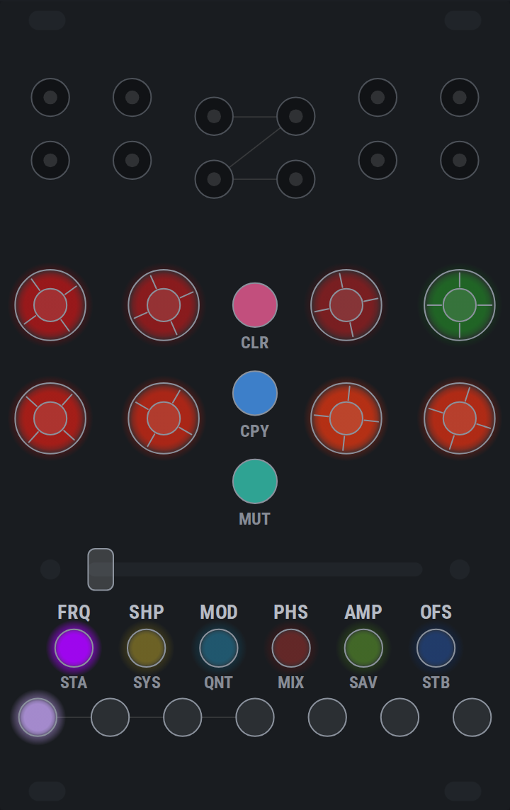

# LED language

The colours are not decoration. One fact per LED, and the same colour for the
same idea on every page - the point being that the panel teaches itself, so the
manual never has to explain a colour.

- **Red and green are a voltage, and nothing else on an encoder is.** The ring
  showing a level, the AMP and OFS parameters, and the live CV on an input jack
  wear the ramp in `led_set_bipolar` — red negative, green positive, warming at
  the extremes. That ramp never lights the blue die, and every other colour on
  the panel does, which is what keeps a setting from reading as a level. The
  error blink borrows red and blanks the panel to say so; the six lit caps keep
  their own colours, because a cap is a label and never shows a value.
- **Ctrl-page settings clamp, they do not wrap.** Each is a short list of
  unrelated states with its default at index 0, so spinning an encoder fully
  left resets it and you can do that without looking. Rolling off one end into
  the other would be the largest change on the page.
- **Setting states** are the base layer, and they live on the cool half of the
  wheel, 30 apart. Index 0 of every setting - disabled, default, neutral - is
  **purple**; **cyan** is continuous / level-following or multiplicative,
  **teal** additive or half-way, **blue** triggered / clocked / stepped.
  Destructive is **pink**, and belongs to clearing alone. **Yellow** is reset,
  and is the one state that keeps a warm hue: it appears only on the SYS scene
  row, which is the one page with no voltage on it anywhere. See `HUE_STATE_*`
  in `color_presets.h`. The output clamp is the one place brightness also
  carries meaning, because it is two facts on one LED.
- **White is assignment, and nothing else uses it.** A short white flash every
  1.6s over an element's own colour means "you can pick this". Once something is
  held, the places it can go are steady white with a short dropout, the held
  source is steady saturated purple, and everything else goes **dark** - if it
  cannot be pressed it does not light.
- **Output level** only appears when no shift mode is active. In a shift mode
  the encoder ring shows that mode's setting, or nothing if it has none.
- **A parameter is drawn as what it is.** With no page open, touching an encoder
  reveals the selected parameter across all eight rings for two seconds. **AMP**
  and **OFS** are volts, so they wear the voltage ramp on the DAC's own scale.
  **SHP**, **MOD** and **PHS** are numbers: the same ramp - dark at zero,
  brightening toward either end - in **teal** positive and **pink** negative,
  where saturation is the third fact and says whether the value is on something
  with a name. Pure on a named shape or on a half or whole turn of phase,
  washing to a pastel between two of them. Which shapes have names depends on
  the shape mode, so PWM's width and the stepped morph have none.
- **FRQ is a ratio, not a level**, so its ring codes three facts on three axes
  rather than drawing a bar. **Hue** is the kind of division: **teal** straight
  (halves, quarters, octaves), **blue** triplet, **pink** quintuplet - octaves
  are free, so 1/8 and 16 are the same teal and 1/3, 3/2 and 24 are the same
  blue. The scale used to be green to orange, which is the voltage ramp end to
  end; it walks the cool half now, so a ratio cannot be read as a level.
  **Saturation** is how far off the grid the value sits, so a fine adjust washes
  the colour out to a pastel and a snapped ratio is pure.
  **Brightness** pulses shallowly at the channel's own output rate, which is
  what says fast from slow, shifting the hue slightly *inward* toward the middle
  of the scale at the peak so a pulse can never brighten a class toward the
  voltage arc; anything too fast for the panel to resolve shimmers
  together at one rate instead of aliasing into a slow phantom pulse.
- **Confirmations** are a brief flash on top: purple wrote, pink cleared, cyan
  loaded. Purple is the selection colour, so a copy landing somewhere flashes
  the colour the source was held in.
- **A held press dips out once as it crosses each of its thresholds** - off,
  then back on - which says "that registered" rather than pulsing away as if
  something were still in progress. At the first stage it comes back exactly as
  the page had it; where holding longer does something wider - clearing every
  scene rather than this one - it comes back brighter, in the same colour.
  Nothing commits until the release.

