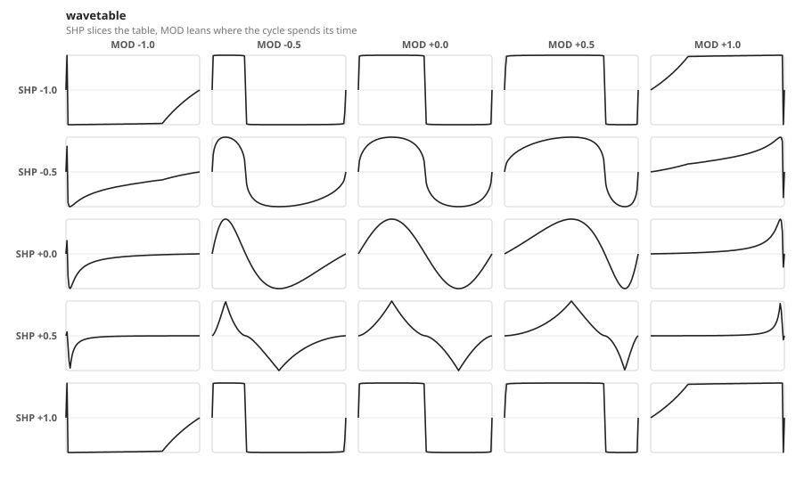
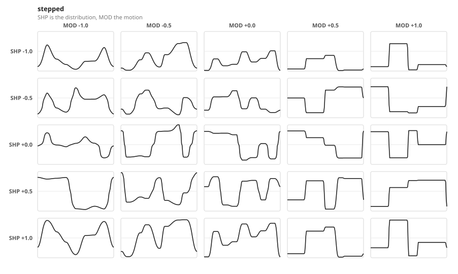
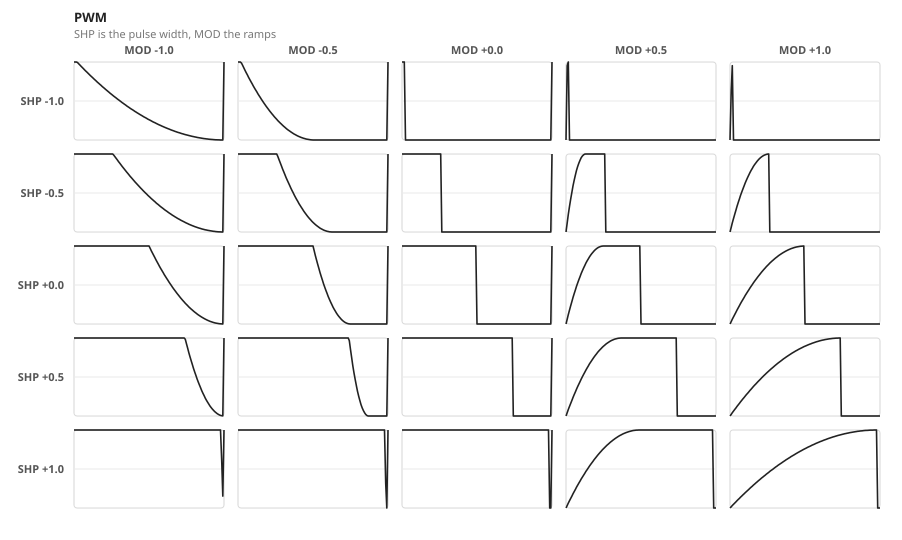

# The three shapes, and what SHP and MOD do in each

Every channel is an oscillator locked to the beat by the PLL. What it draws
between one cycle and the next is its **shape mode**, and each mode gives the
same two knobs a different job. The figures are generated from the module's own
shape functions by `just shape-figures` - a picture here cannot show a shape the
firmware does not have.

Read them as a grid: **SHP down the rows, MOD across the columns.**

## Wavetable

The classic shapes and everything between them. **SHP** slices a 64-frame table
that runs square - sine - triangle - pointy and back to square, so the knob
wraps. **MOD** leans where the cycle spends its time: negative pulls the
waveform early, positive pushes it late, and the ends of the knob stop short of
where the warp would collapse.

Every setting reaches full swing with no DC offset - between slices as well as
on them, which is a guarantee the table is generated to hold rather than
something it happens to do. See [wavetable.md](wavetable.md).

## Stepped

A pattern of values, one per step, locked to the beat and eased between. Not
random: every value is a deterministic function of the two knobs, the pattern
length and the phase, re-derived from the PLL on every tick. What the knobs move
you through is a *space of patterns*, which is why neighbouring settings sound
related rather than being fresh draws.

**SHP** is the distribution the values are drawn into, and which pattern they
come from:

| | |
|---|---|
| hard left | mostly low, with the peaks still reaching - modulation that sits down and occasionally spikes |
| centre | even |
| hard right | bunched against both rails - gate-like, mostly high or mostly low |

Underneath that the pattern itself advances, so the knob reaches different
patterns as well as different distributions. It is periodic: past the end is
where it started.

**MOD** is motion. At one end every step takes a new value and the curve is
fully slewed between them; at the other most steps tie to the one before and the
curve sits still on each. Density, which steps tie, how far the beat swings,
whether the cycle repeats a quarter-length phrase, and the ease all move
together along it. Unlike SHP it does not wrap - its ends are opposite ends.

**Pattern length** is a per-channel setting rather than a scene parameter,
because there is nothing between 8 steps and 12 for a crossfade to land on. See
[stepped.md](stepped.md) for how the shape is built and what holds it together.

## PWM

A gate with an envelope on it. **SHP** is the pulse width, off both end stops so
the pulse never disappears entirely. **MOD** is how much of that pulse is ramp
rather than plateau, and its sign is how the ramp is split between the two ends:

| | |
|---|---|
| 0 | a hard gate, so a PWM channel is still a clock divider |
| part way | attack, plateau, decay - an AD envelope, biased by the sign |
| hard left | one decay filling the pulse: percussive, instant attack |
| hard right | one attack filling the pulse: a ramp up, then a hard drop |

Both ramps live inside the pulse, so **SHP is the envelope's length** as much as
the gate's width, and nothing bleeds past it. A short trigger with a long tail
is a wide SHP at MOD hard left rather than a narrow one.

MOD used to give each edge its own segment - the rise inside the on-time, the
fall inside the off-time. That kept the width honest, but it put the two ramps on
opposite sides of the pulse edge so they could never coexist, and no setting on
the knob was an AD envelope. It also ran the decay's length *inverse* to the
width, because what it had to spend was the off-time: a wide pulse had nowhere
to decay into.

The ramps are curved rather than linear, which is what makes them read as an
envelope rather than as a triangle: the attack is concave and the decay convex.

## What the modes share

- **Phase 0 is the rising edge** in every shape: it is where PWM opens its gate
  and where the stepped mode starts step 0. A square channel at a whole division
  is therefore a clock divider whose gate opens on the beat.
- **The knobs do not change the level.** Each shape either reaches full swing by
  construction (wavetable, PWM) or is corrected to a steady one (stepped), so a
  turn changes what the shape does rather than how much of it there is. How loud
  is AMP's business, and where it sits is OFS's.
- **AMP, OFS, FRQ and PHS mean the same thing everywhere**, which is what makes
  the mode a property of the channel rather than a different instrument.
